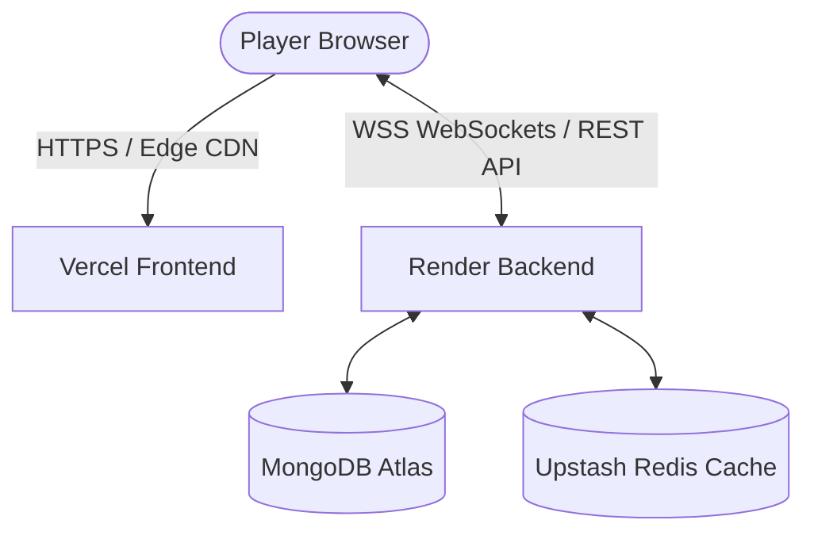
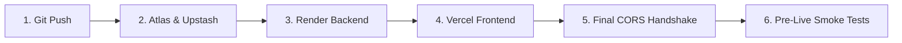

# ChessVerse Production Deployment Guide

This guide details the step-by-step production deployment of ChessVerse using the proven decoupled cloud architecture:
- **Frontend**: **Vercel** (Global Edge CDN, Next.js 16 App Router)
- **Backend**: **Render** (Node.js Express 5 + Socket.IO real-time persistent WebSockets)
- **Database**: **MongoDB Atlas** (Free M0 shared cluster with least-privilege access)
- **Cache & Presence**: **Upstash Redis** (Serverless Free Tier)

---

## Architecture Overview



> **Why decoupled?**
> Next.js frontend pages and static assets benefit from Vercel's global edge network. Real-time multiplayer chess matchmaking, clock timers, and live move broadcasts require continuous, long-lived WebSocket connections (`socket.io`), which Render hosts 24/7 with zero connection timeouts.

---

## Critical Security & Configuration Rules

> [!CAUTION]
> **Never Commit Secrets to Version Control**
> `DATABASE_URL`, `REDIS_URL`, `JWT_SECRET`, and `SESSION_SECRET` must **only** be configured inside Render and Vercel dashboard environment variables. All `.env`, `.env.local`, and `.env.production` files are strictly excluded via `.gitignore`. Only `.env.example` templates with empty values are tracked.

1. **Dynamic PORT Binding**:
   - Render dynamically injects `$PORT` into the web service container at startup.
   - The server binds dynamically without hardcoded ports:
     ```ts
     const PORT = Number(process.env.PORT) || 4000;
     const HOST = process.env.HOST || "0.0.0.0";
     httpServer.listen(PORT, HOST, () => { ... });
     ```
2. **Secure WebSocket URL**:
   - `NEXT_PUBLIC_SOCKET_URL` uses the standard Render HTTPS URL (e.g. `https://chessverse-backend.onrender.com`).
   - The Socket.IO client automatically negotiates and upgrades this to secure WebSockets (`wss://`).
3. **Strict CORS & CSRF (No Wildcards)**:
   - The backend restricts origins strictly to your configured `CLIENT_URL` (the exact Vercel production domain).
   - Wildcards (`*`) are strictly prohibited because cookie credentials (`credentials: true`) are used for session authentication.
4. **Hardened Docker Compose**:
   - In `docker-compose.yml`, MongoDB and Redis do **not** expose host ports to the public internet (`27017` / `6379` are internal to the private Docker bridge network). Only the application endpoints (`3000` and `4000`) or reverse proxies are published.

---

## Recommended Deployment Order



### Step 1: Push Repository to GitHub

1. Confirm git status has no secrets:
   ```bash
   git status
   ```
2. Stage, commit, and push your repository:
   ```bash
   git add .
   git commit -m "feat: production deployment setup"
   git branch -M main
   git remote add origin https://github.com/<YOUR_GITHUB_USERNAME>/chessverse.git
   git push -u origin main
   ```

---

### Step 2: Set Up MongoDB Atlas & Upstash Redis

#### A. MongoDB Atlas (Database)
1. Go to [MongoDB Atlas](https://www.mongodb.com/atlas) and sign in.
2. Create a free **M0 Shared** cluster.
3. Under **Security > Database Access**:
   - Create a dedicated database user (e.g., `chessverse_user`).
   - Assign the **readWriteAnyDatabase** or specific database role (least privilege).
   - Generate a strong, unique 32+ character password.
4. Under **Security > Network Access**:
   - Click **Add IP Address** -> Select **Allow Access From Anywhere (`0.0.0.0/0`)** -> Confirm.
   *(Since Render utilizes dynamic IP pools, `0.0.0.0/0` is required. The database is protected by TLS encryption, username/password auth, and least-privilege roles).*
5. Click **Connect > Drivers** and obtain your connection string:
   ```text
   mongodb+srv://chessverse_user:<password>@cluster0.xxxx.mongodb.net/chessverse?retryWrites=true&w=majority
   ```

#### B. Upstash Redis (Cache & Session Store)
1. Go to [Upstash Console](https://console.upstash.com/) and create a free Redis database.
2. Select your preferred region (ideally close to your Render region).
3. Copy the standard connection URL:
   ```text
   rediss://default:<password>@<endpoint>.upstash.io:6379
   ```

---

### Step 3: Deploy Backend on Render

1. Go to [dashboard.render.com](https://dashboard.render.com/) -> Click **New + > Web Service**.
2. Connect your GitHub repository (`chessverse`).
3. Fill in the service configuration:
   - **Name**: `chessverse-backend`
   - **Root Directory**: `server`
   - **Runtime**: `Node`
   - **Build Command**: `npm install --include=dev && npm run build`
   - **Start Command**: `npm start`
   - **Instance Type**: `Free`
4. Under **Environment Variables**, add:

| Variable | Value | Notes |
| :--- | :--- | :--- |
| `NODE_ENV` | `production` | Enables production optimizations |
| `DATABASE_URL` | `mongodb+srv://...` | MongoDB Atlas URI from Step 2A |
| `REDIS_URL` | `rediss://...` | Upstash Redis URI from Step 2B |
| `CLIENT_URL` | `http://localhost:3000` | Temporary value until Vercel URL is generated |
| `JWT_SECRET` | *(Generate a random 32+ char string)* | Token signing |
| `SESSION_SECRET` | *(Generate a random 32+ char string)* | Cookie session signing |
| `SESSION_EXPIRY_DAYS` | `30` | Session lifetime |
| `OPENAI_API_KEY` | *(Optional)* | Only if using OpenAI analysis features |

> **Note on PORT**: Do not set `PORT` in Render environment variables. Render automatically supplies its own `$PORT` at runtime, which `server/src/index.ts` automatically consumes.

5. Click **Create Web Service**.
6. **Verify Backend Before Moving On**:
   - Wait for the build and deployment logs to say `ChessVerse server running on http://0.0.0.0:<port>`.
   - Open your Render URL in your browser: `https://chessverse-backend.onrender.com/`.
   - It must return the health JSON:
     ```json
     {"success":true,"service":"ChessVerse API","status":"running","version":"1.0.0"}
     ```

---

### Step 4: Deploy Frontend on Vercel

1. Go to [vercel.com](https://vercel.com/) -> Click **Add New... > Project**.
2. Import your `chessverse` repository.
3. Configure the project:
   - **Framework Preset**: `Next.js`
   - **Root Directory**: `./` (default repository root)
   - **Build Command**: `next build` (default)
   - **Output Directory**: `.next` (default)
4. Under **Environment Variables**, configure:

| Variable | Value | Notes |
| :--- | :--- | :--- |
| `NEXT_PUBLIC_API_URL` | `https://chessverse-backend.onrender.com` | Backend REST API endpoint from Step 3 |
| `NEXT_PUBLIC_SOCKET_URL` | `https://chessverse-backend.onrender.com` | HTTPS URL for Socket.IO auto-upgrade to WSS |

5. Click **Deploy**. Vercel will compile and host your app live on `*.vercel.app` in ~60 seconds.

---

### Step 5: Final CORS Update

1. Once Vercel finishes deploying, copy your exact production domain (e.g. `https://chessverse-app.vercel.app`).
2. Return to **Render Dashboard > chessverse-backend > Environment**.
3. Update `CLIENT_URL` with your exact Vercel production domain:
   ```text
   CLIENT_URL=https://chessverse-app.vercel.app
   ```
4. Click **Save Changes**. Render will automatically restart the service with updated CORS/CSRF headers.

---

## Step 6: 13-Point Pre-Live WebSocket & Verification Checklist

Before announcing ChessVerse live to users, execute these 13 verification tests across the live Vercel and Render deployments:

- [ ] **1. API Calls from Vercel**: Open browser DevTools Network tab on your Vercel URL and confirm `/health` or initial API fetches succeed with `200 OK` (no CORS origin errors).
- [ ] **2. WebSocket Handshake & Upgrade**: 
  - Socket.IO initially negotiates over HTTP long-polling and then seamlessly upgrades to WebSocket.
  - Verify that:
    - Socket.IO connection status = `connected`
    - Transport = `websocket`
    - Secure connection = `wss://`
- [ ] **3. Registration & Login**: Create a new account with email/password and verify successful redirect.
- [ ] **4. Authentication Persistence**: Refresh the browser page (`F5`) and confirm you remain logged in via HTTP-only cookie.
- [ ] **5. Creating a Chess Game**: Create a new custom room or challenge and receive an invite link.
- [ ] **6. Multi-Device Match**: Open the game URL in a second private/incognito window or mobile phone. Confirm both White and Black connect.
- [ ] **7. Real-Time Move Sync**: Make move `1. e4` as White. Confirm Black's board updates smoothly in real time across the network.
- [ ] **8. Authoritative Game Timers**: Verify White's clock counts down only during White's turn, switches cleanly on move completion, and applies increments.
- [ ] **9. Resignation & Draw**: Test offering a draw and resigning. Verify the authoritative game result dialog pops up on both clients.
- [ ] **10. Rematch Negotiation**: Propose a rematch and confirm both sides must accept before the new board initializes.
- [ ] **11. In-Game Real-Time Chat**: Send messages back and forth and confirm real-time delivery.
- [ ] **12. Network Reconnection Grace**: Temporarily disable Wi-Fi/data on one device for 5 seconds. Re-enable and confirm the socket reconnects smoothly and rehydrates the full board snapshot without freezing.
- [ ] **13. Logout & Session Revocation**: Click Logout and verify the session cookie is cleared and authenticated routes redirect to `/login`.

---

## Final Production Acceptance (The 4 Golden Gates)

ChessVerse is certified production-ready when these four criteria succeed on the live deployed URLs:

1. **Gate 1: Render Health Probe**
   `GET /` from your Render backend URL returns `{"success":true,"service":"ChessVerse API","status":"running","version":"1.0.0"}`.
2. **Gate 2: CORS Authorization**
   Vercel frontend makes API requests to Render without origin or CSRF rejections.
3. **Gate 3: Two-Player Real-Time Parity**
   Two independent clients/browsers can play the same game with real-time moves, clock synchronization, and terminal game states.
4. **Gate 4: Session & Reconnection Resilience**
   Authentication and session state survive page refreshes, logouts cleanly revoke cookies, and games recover from temporary network drops.

---

## Alternative: Self-Hosted Docker Compose on VPS

For self-hosting on a single cloud VPS (Ubuntu on Hetzner, DigitalOcean, or AWS EC2):

1. Clone repository to your server:
   ```bash
   git clone https://github.com/<YOUR_GITHUB_USERNAME>/chessverse.git
   cd chessverse
   ```
2. Start the isolated stack:
   ```bash
   docker compose up -d --build
   ```
   *Notice: MongoDB and Redis are strictly kept on the internal container network and never exposed to the public internet.*
